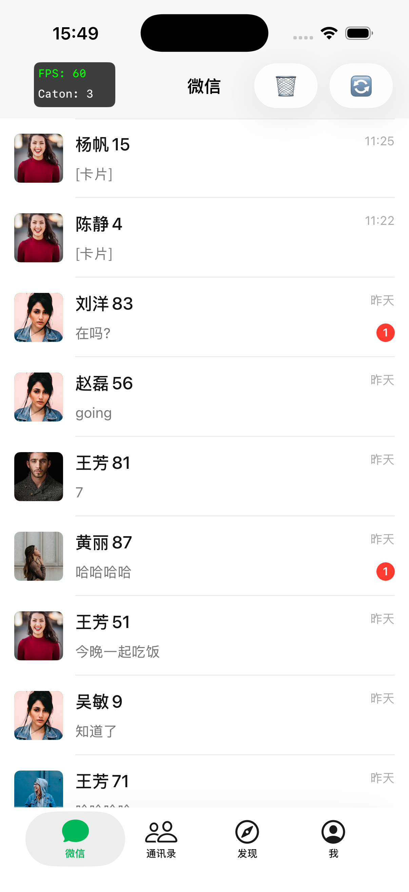
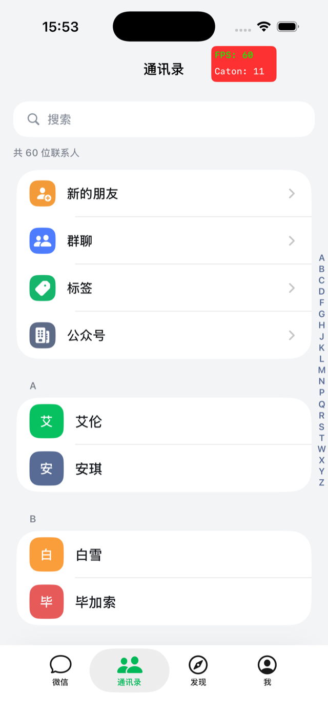
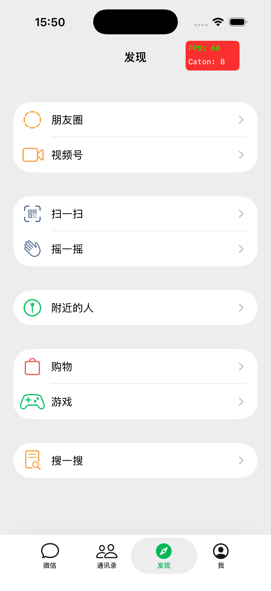
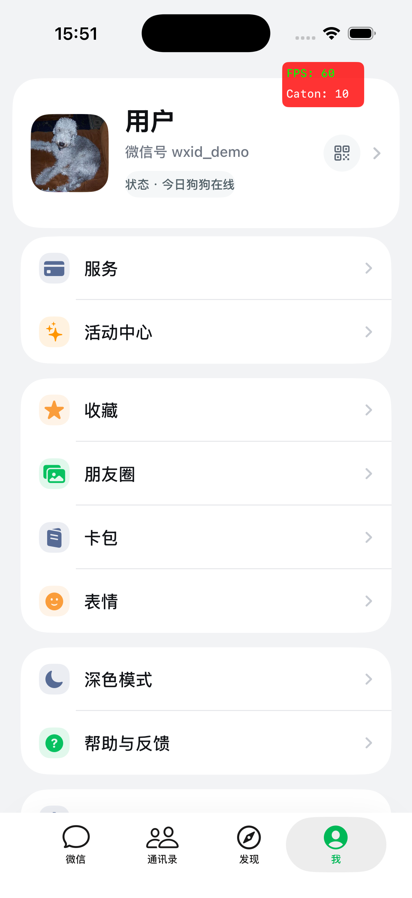
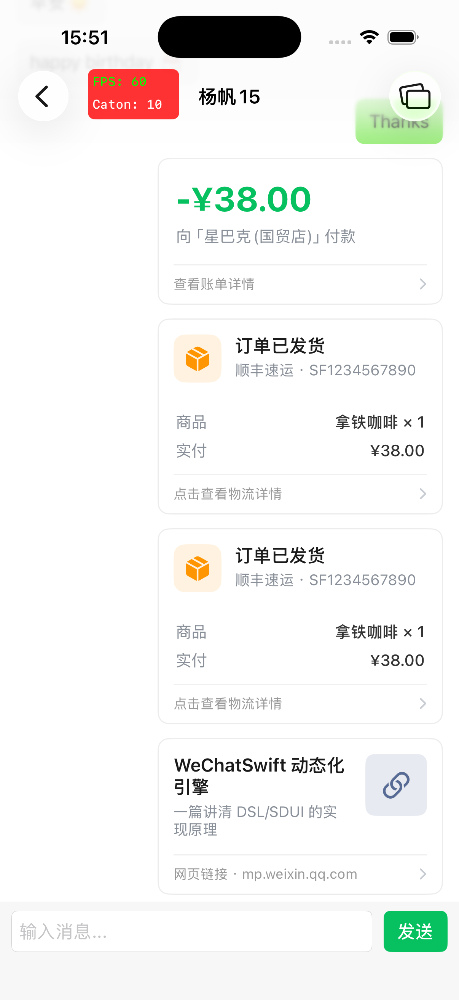
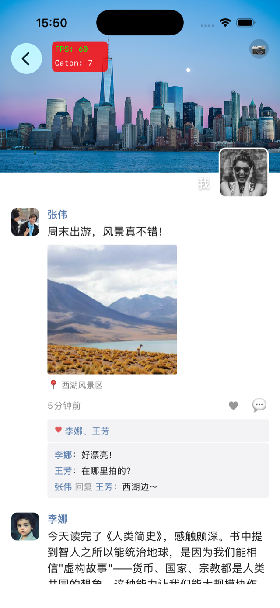
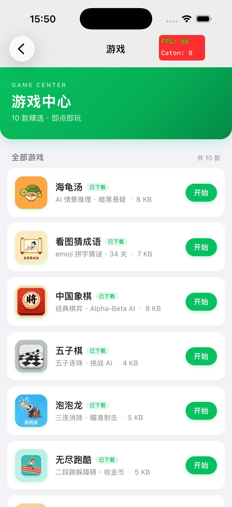

# WeChatSwift

> 一个工程深度优先的「仿微信」iOS 客户端 —— Swift + UIKit 原生开发，
> 在还原微信主流程的同时，落地一套大厂级的客户端基础设施：
> **动态化（SDUI/DSL）、React Native 新架构混合、自研 IM SDK、AI 能力接入、性能（卡顿）监控、热更新**。

本项目的重点不在「画 UI」，而在于把每一项能力都做成**可复用、可灰度、可回滚、可观测**的工程模块。

---

## 🔗 项目矩阵（一壳两端）

这是一套「**原生壳 + 动态内容**」的仿微信系列，由三个仓库协作：本仓库（Swift）是宿主壳，
另两个仓库分别以 **RN 页面** 和 **H5 游戏** 的形式被它承载，且都走 OSS 热更、免发版上线。

| 仓库 | 角色 | 说明 |
|---|---|---|
| **[StudyDemoSwift](https://github.com/crunkzhang/StudyDemoSwift)**（本仓库） | 原生 iOS 壳 / 宿主 | Swift + UIKit，承载原生页 / RN 页 / H5 游戏，并提供 IM、AI、动态化、热更、监控等基础设施 |
| **[StudyDemoRN](https://github.com/crunkzhang/StudyDemoRN)** | RN 页面提供方 | RN 0.84 新架构（Fabric + TurboModule）+ TS，19 个二级页面以「页面」身份嵌入原生壳，JS bundle 走 OSS 热更 |
| **[StudyDemoWebGames](https://github.com/crunkzhang/StudyDemoWebGames)** | H5 小游戏 | 11 款AI完成 H5 小游戏，打包 zip 走 OSS 热更，被本仓库的 `GameModule` 动态加载、即点即玩 |

> 对应到本仓库：RN 页由 [`WeChatRN`](#️-wechatrn--rn-新架构混合--一套可上线的-bundle-热更新) 承载，
> H5 游戏由 [`GameModule`](#-gamemodule--oss-动态加载的小游戏平台--海龟汤-ai-游戏) 动态下发。

---

## ✨ 核心亮点

| 能力 | 模块 | 说明 |
|---|---|---|
| ⚛️ React Native 混合 | `WeChatRN` | RN New Architecture（Hermes + Fabric）；Bridge / 事件总线 / Bundle 热更新（下载·版本·sha256·灰度·回滚） |
| 🎮 小游戏平台 | `GameModule` | 游戏从 **OSS 动态下发**（manifest + sha256 + 灰度 + 回退），H5 经 JS Bridge 调端上 AI；首发「海龟汤」AI 出题/裁判推理游戏 |
| 🤖 AI 能力接入 | `AIKit` | 统一 Provider 抽象，DeepSeek / 通义 / 智谱 **运行时一键切换**（OpenAI 兼容）+ Claude；SSE 流式、Keychain 存密钥 |
| 🧩 动态化页面引擎（SDUI） | `DSLKit` | JSON 描述页面 → 原生渲染 → OSS 热更，免发版改页面；支持组件注册、灰度、回滚、版本校验、可观测 |
| 💬 自研 IM SDK | `WCIMSDK` | 基于 WCDB 的本地存储、seqId 增量同步、推送、分会话上传、DB 变更流 |
| 📉 性能 / 卡顿监控 | `CatonMonitorKit` | FPS / RunLoop / Watchdog 多探测器、堆栈抓取与符号化、页面追踪、磁盘存储、调试浮层 |
| 🚦 启动任务编排 | `WeChatSwift/Launch` | DAG 启动调度：依赖拓扑 + 四种触发时机 + 超时 / 失败策略 + 环检测；`sysctl` + RunLoop 首帧度量 |
| 🌐 网络基础设施 | `DDNetwork` | `URLSession + async/await` 轻量网络库，Endpoint 描述、拦截器、认证、重试、日志 |
| 🧭 路由 / 解耦 | `NavigateKit` · `WeChatRouter` | `wechat://` URL 路由，模块间零直接依赖 |

---

## 📱 界面预览

**四个主 Tab**（左上角红/绿浮层是内置的 [`CatonMonitorKit`](#-catonmonitorkit--卡顿--性能监控可独立复用的-submodule) 实时 FPS / 卡顿计数）：

<table>
  <tr>
    <td align="center"><br><sub><b>微信</b>　会话列表 · 原生</sub></td>
    <td align="center"><br><sub><b>通讯录</b>　拼音分组 + 字母索引</sub></td>
    <td align="center"><br><sub><b>发现</b>　8 个功能入口</sub></td>
    <td align="center"><br><sub><b>我</b>　整页 DSL 动态化</sub></td>
  </tr>
</table>

**三种渲染形态同框**——原生壳里跑着 DSL 卡片、RN 页面、H5 游戏：

<table>
  <tr>
    <td align="center"><br><sub><b>结构化消息卡片</b><br>聊天气泡内由 <code>DSLKit</code> 渲染（付款 / 订单 / 图文卡片）</sub></td>
    <td align="center"><br><sub><b>朋友圈</b><br><code>WeChatRN</code> 承载的 RN 页面</sub></td>
    <td align="center"><br><sub><b>游戏中心</b><br><code>GameModule</code> 从 OSS 动态加载的 H5 游戏</sub></td>
  </tr>
</table>

---

## 🧱 技术栈

- **语言 / UI**：Swift 5.0 + UIKit
- **架构**：模块化分层（Foundation / WeChatKit / Platform / Business）+ URL 路由解耦
- **依赖管理**：CocoaPods（**静态 podspec** 本地组件化）
- **项目生成**：XcodeGen（`project.yml`，不手改 `.xcodeproj`）
- **跨端**：React Native（New Architecture：Hermes / Fabric / TurboModules）
- **存储**：WCDB（IM 本地库）
- **基础组件**：作为 **git submodule** 独立维护（见 `Foundation/`）
- **最低系统**：iOS 15.1+

---

## 🗂 架构分层

四层架构，依赖单向向下（上层依赖下层，业务之间通过路由解耦）：

```
┌──────────────────────────────────────────────────────────────┐
│  WeChatSwift (App)  —  AppDelegate / SceneDelegate / TabBar    │
└──────────────────────────────────────────────────────────────┘
            │
┌──────────────────────────── Business ─────────────────────────┐
│  ChatModule   ContactModule   DiscoverModule   MeModule  Game  │
└──────────────────────────────────────────────────────────────┘
            │
┌──────────────────────────── Platform ─────────────────────────┐
│  WCIMSDK（IM 能力中台：DB / 同步 / 推送）                        │
└──────────────────────────────────────────────────────────────┘
            │
┌──────────────────────────── WeChatKit ────────────────────────┐
│  WeChatUI   WeChatRouter   WeChatNetAPI                        │
│  WeChatRN   DSLKit   AIKit（微信特有的共享能力）                 │
└──────────────────────────────────────────────────────────────┘
            │
┌──────────────────────────── Foundation ───────────────────────┐
│  ExtensionKit   NavigateKit   DDNetwork   CatonMonitorKit      │
│  （零业务依赖，可跨项目复用 · git submodule）                    │
└──────────────────────────────────────────────────────────────┘
```

| 层 | 目录 | 定位 |
|---|---|---|
| **Foundation** | `Foundation/` | 通用基础组件，零业务依赖，独立 submodule 维护 |
| **WeChatKit** | `Modules/WeChatKit/` | 微信特有、跨业务复用的能力（UI / 路由 / 网络 / RN / DSL / AI） |
| **Platform** | `Modules/Platform/` | 能力中台（IM SDK） |
| **Business** | `Modules/Business/` | 具体业务模块，独立 podspec |

---

## 📁 目录结构

```
WeChatSwift/
├── Foundation/                 # 通用基础组件（git submodule）
│   ├── ExtensionKit/           # UIKit / Foundation 扩展（UIColor(hex:) 等）
│   ├── NavigateKit/            # URL 路由框架
│   ├── DDNetwork/              # async/await 网络库（Endpoint / 拦截器 / 认证 / 重试）
│   └── CatonMonitorKit/        # 卡顿 & 性能监控（FPS / RunLoop / Watchdog / 堆栈 / 浮层）
├── Modules/
│   ├── WeChatKit/              # 微信特有共享层
│   │   ├── WeChatUI/           # 主题（微信绿 #07C160）与基础组件
│   │   ├── WeChatRouter/       # 路由表（wechat:// 常量）
│   │   ├── WeChatNetAPI/       # 微信业务接口定义
│   │   ├── WeChatRN/           # RN 运行时 / Bridge / 事件 / Bundle 热更
│   │   ├── DSLKit/             # 动态化页面引擎（SDUI）
│   │   └── AIKit/              # AI Provider 抽象与接入
│   ├── Platform/
│   │   └── WCIMSDK/            # IM SDK（WCDB / 同步 / 推送）
│   └── Business/               # 业务模块
│       ├── ChatModule/         # 聊天（会话列表 + RN/原生详情）
│       ├── ContactModule/      # 通讯录（拼音分组 + 字母索引）
│       ├── DiscoverModule/     # 发现（朋友圈 / 视频号 / 扫一扫 / 游戏 …）
│       ├── MeModule/           # 我（DSL 动态化首发页）
│       └── GameModule/         # 游戏大厅 + 海龟汤 AI 游戏
├── WeChatSwift/                # 主工程（App 入口 / TabBar）
├── docs/                       # 架构文档、设计 spec、实施 plan
├── project.yml                 # XcodeGen 配置
├── Podfile                     # CocoaPods（单 target 扁平 + 本地静态 podspec）
└── setup.sh                    # 一键生成工程 + 安装依赖
```

---

## 🔍 核心能力详解

> 下面几节按模块说清楚**各自解决什么问题、怎么实现、为什么这么取舍**。

---

### ⚛️ WeChatRN —— RN 新架构混合 + 一套可上线的 Bundle 热更新

不是「下个 jsbundle 替换一下」，而是一套带**灰度、健康度自愈、原子安装、全链路埋点**的发布系统。

**整条更新链路**（`RNBundleManager` 编排，职责拆成 5 个 Agent）：

```
启动
 ├─ checkRollback()      失败计数 +1 → 连续失败 ≥3 自动回滚到内置版
 ├─ 监听 RCTJavaScriptDidLoadNotification → markHealthy()（清零失败计数）
 ├─ checkUpdate() ──► BundleConfigFetcher 拉 OSS 配置
 │                    └► BundleVersionResolver 决策版本
 │                         · 按版本号降序取「首个命中」的最高可用版
 │                         · minAppVersion 门槛（语义化版本逐段比较）
 │                         · 白名单直通 / 否则按设备灰度分桶
 │                    └► BundleDownloader 下载到 downloading/
 │                         · sha256 校验，不匹配即丢弃
 │                         · 校验通过才原子 move 到 current/（避免半包覆盖）
 │                         · applyMode: immediate(发通知热替换) / nextLaunch
 └─ startPolling()       30min 轮询（带 60s 最小检查间隔节流）
```

几个关键设计点：

- **灰度怎么稳定分桶**：`abs(sha256(deviceId).prefix4) % 100 < percentage`，
  同一设备每次结果一致、跨进程一致，灰度比例不失真；`percentage` 边界 0/100 短路。
- **健康度自愈状态机**：`consecutiveFailures` 落盘，启动即 +1、JS 加载成功才清零；
  连续 3 次启动都没成功加载 → 判定新包有问题，**自动回滚**并清空 current，永远有内置兜底。
- **下载安全**：临时目录 `downloading/` 下载 → sha256 比对 → `moveItem` 原子落位 `current/`，
  任一步失败都清理临时文件，保证 `current/main.jsbundle` 要么是完整可用包、要么不存在。
- **全链路可观测**：`check / available / downloadStart / success / fail(分类型) / rollback / apply`
  每个节点都带 `deviceId / version / 命中方式 / 耗时 / 错误类型` 埋点，可对接监控大盘。

> 桥接层同样成体系：Bridge（扫码/导航栏/Toast/缓存/网络/导航/设备/权限）+ 事件总线
> （`EventBus`/`EventBridge`/`EventRegistry` 双向通信），基于 RN **New Architecture**（Hermes/Fabric）。

---

### 🎮 GameModule —— OSS 动态加载的小游戏平台 + 海龟汤 AI 游戏

这个模块把两件事捏在一起：**像小程序一样从 OSS 动态加载 H5 游戏**，以及**让游戏通过 Bridge 调到端上的 AI 能力**。海龟汤（一个 AI 出题/裁判的推理游戏）就是跑通整条链路的第一个例子。

**1）游戏不进 App 包，从 OSS 动态下发**（`GameBundleManager`）

大厅里有哪些游戏、各自什么版本，全由一份远端 `manifest` 说了算——加游戏、改版本都不用发版：

```
启动 → 拉 manifest（games[].{id, version, url, sha256, size, capabilities, grayscale}）
      → 写本地缓存 → 大厅按 manifest 渲染卡片 → 30min 轮询
进入某个游戏：bundleURL(for:)
      ├─ 灰度未命中 → 不下发
      ├─ 本地已有该版本 → 直接返回 index.html（秒开）
      ├─ 未命中本地 → 下载到「按 id/版本隔离」的目录 → sha256 校验 → 落地
      └─ 同一游戏并发进入 → in-flight Task 合并，只下一次
当前版加载失败 → fallbackBundleURL() 回退到本地上一个版本，不让用户卡在黑屏
```

每个 `GameEntry` 还带了些实用字段：`backgroundColor`（容器底色，盖住 H5 加载空隙的黑屏）、
`capabilities`（声明这游戏要不要原生能力，比如 `["bridge"]` 表示要调 AI）、`grayscale`（灰度放量）。
版本按目录隔离存放，所以「下新版」和「回退旧版」天然共存。

**2）H5 ↔ 原生 的 Bridge：按需注册、命名空间隔离、异步回调**

`GameRunnerViewController` 用 WebView 承载游戏，`GameBridge` 基于 `WKScriptMessageHandler` 收 JS 调用，
靠 `callId` 把「JS 发起 → 原生异步处理 → 回调 JS」串成一次完整调用。Handler 按**命名空间**拆开、
**按游戏声明的 capabilities 按需注册**——纯 web 游戏一个原生 handler 都不挂：

- `sys.*`（`SysBridgeHandler`）：Toast、`sys.haptic` 触觉反馈等通用能力
- `ai.*`（`AIBridgeHandler`）：海龟汤专用，把 AI 能力暴露给 H5

**3）海龟汤：一局游戏怎么跑**

游戏前端只管画 UI，所有"智能"都通过 `ai.*` Bridge 落到端上的 `HaiguitangService`：

| H5 调用 | 端上做的事 |
|---|---|
| `ai.startPuzzleStream` | **流式**生成一道谜题（难度 / 主题 / `avoid` 防重复），边生成边上屏 |
| `ai.ask` | 玩家提问，AI 带**历史上下文**做"是/否/无关"裁判，保证前后一致 |
| `ai.guess` | 玩家猜底，命中则公布完整汤底 |
| `ai.hint` | 给提示 |

整条链路带重试与安全降级，AI 抽风时不会把游戏卡死。

**4）AI 三家厂商，运行时一键切换**（`AIKit` / `AIConfig`）

海龟汤背后的 AI 不绑定单一厂商。`AIVendor` 把 **DeepSeek / 通义千问 / 智谱 GLM** 收敛成枚举，
三家都走 OpenAI 兼容协议，所以共用同一个 `OpenAICompatProvider`，差异只剩 `baseURL / model`：

```swift
AIConfig.select(.deepseek)   // 切厂商：持久化选择 → 用 Keychain 里的 key 重新装配 AIClient
// 业务侧（HaiguitangService）只认 AIClient.shared，完全不感知换了谁
```

- 当前厂商持久化在 `UserDefaults`，默认 DeepSeek；密钥存 **Keychain**（`KeychainAIKey`），不进代码、不进包。
- 另保留 `ClaudeProvider`（Anthropic Messages API）与 Mock，兼容直连 / 代理 / 离线三种装配。

> 这套「manifest 驱动 + 下载/sha256/灰度/回退 + Bridge 调原生」的玩法，正是后来 **DSLKit/SDUI**
> 动态化页面引擎的能力雏形——先在游戏这种低风险场景跑通，再推广到正式页面。

---

### 🤖 AIKit —— 多厂商 AI 接入（可热切换 / 流式 / 密钥安全）

- **统一 `AIProvider` 抽象**，运行时一行切换厂商，业务层零感知。
- 适配 **Claude（Anthropic Messages API）** 与 **DeepSeek / 通义 / 智谱**——
  后三家用同一个 `OpenAICompatProvider`（OpenAI 兼容协议）收敛，新增厂商≈加个配置。
- **SSE 流式**输出（边出题边上屏）；`KeychainAIKey` 把密钥存进 Keychain；
  Debug 走本地代理、Release 直连，避免密钥进包。

---

### 🧩 DSLKit —— 动态化页面引擎（SDUI / OSS 下发）

在「原生」与「RN/H5」之间补上 **比原生灵活、比 RN/H5 轻** 的动态化中间层：
页面用 JSON 描述 → 走 OSS 下发 → **客户端原生渲染**，免发版改页面。复用了 RN 热更的同一套发布范式，但解决了「页面渲染要**即时同步**拿到数据」这个新约束。

**读写分离 + 三级降级**（`PageSchemaManager`）：

- **读 `page(for:)` 是同步的**（VC 渲染等不起）：`内存缓存 → 磁盘当前版 → 内置兜底`，
  逐级 fallback，每一级都过校验，拿不到可渲染页就返回 `nil`（绝不渲染白页）。
- **刷新 `refresh()` 是异步且去重的**：启动 + 每次进页可能并发触发，用 in-flight `Task` 合并成一次，
  不重复打网络/写磁盘；为保住同步读语义，用 `NSLock` 临界区而非 actor（注释里写明了取舍）。

**三重校验门 + 单页隔离**（坏 schema 永远进不了渲染）：

1. JSON 能解析；2. `minClient ≤ 端能力版本`（向前兼容，老端自动忽略新组件页）；
3. **至少含一个已注册顶层组件**——挡掉「空页/全是未知组件」导致的白屏。
校验不过就**保留旧版、不污染当前版**；多页下发时**单页失败不阻断其他页**。

**按页独立灰度（比 RN 那套更细）**：`Grayscale` 用 **FNV-1a(deviceId + pageId)** 分桶——
同一设备在不同页面的灰度桶**相互无关**，而不是「要么全中要么全不中」，分布也比字符求和更均匀。

**安全阀**：运行期发现新版有问题，`rollback(pageId:)` 一键回退到上一版本；
Action 分发带 **scheme 白名单**，下发的跳转只能走允许的 `wechat://` 协议。

> 首发试验田：**「我的」页整页 DSL 化**（低频、低风险、标准列表型）；
> 并已支撑 **IM 结构化消息卡片** —— DSL 渲染直接进聊天气泡。

---

### 💬 WCIMSDK —— 自研 IM SDK（增量同步 / 本地库 / 不丢消息）

- **本地库**：基于 **WCDB**，消息**按会话分表**（`MessageTableNameRegistry`），写入走事务；
  `DBChangeStream` 把 DB 变更转成事件流，驱动 UI 用 **DiffableDataSource** 增量刷新。
- **seqId 增量同步**：以 `seqId` 为游标拉增量（`fetchIncremental(after:)`），
  `SyncCoordinator` 编排首屏/进页/兜底等触发时机（`SyncTriggers`）。
- **不丢消息的关键**：`SeqIdManager` 单点推进 seqId，且**只在 DB 事务 commit 之后**才 `advance`——
  保证「游标已前进 = 数据已落库」，进程被杀也能从正确位置续传，不漏不重。
- 推送（`PushService`）、分会话媒体上传（`PerSessionUploader`）。

---

### 📉 CatonMonitorKit —— 卡顿 & 性能监控（可独立复用的 submodule）

- **多探测器并行**：`FPSDetector`（掉帧）/ `RunLoopDetector`（RunLoop 超时）/ `WatchdogDetector`（主线程假死）。
- 卡顿现场**抓主线程堆栈并符号化**（`StackCapture`）、页面停留追踪（`PageTracker`）。
- 磁盘存储 + 可配置上报策略；内置**调试浮层**（`CatonOverlayWindow`）实时看 FPS / 卡顿事件。

---

### 🚦 启动任务编排 —— DAG 启动调度 + 首帧度量（`WeChatSwift/Launch`）

把「一堆 SDK 挤在 `didFinishLaunching` 里顺序 setup」重构成**有向无环图调度**：每个启动项声明
依赖、触发时机、超时与失败策略，调度器按拓扑顺序并发执行，把非关键项挪出启动主路径。

- **四种触发时机**：`syncAtStart`（阻塞首帧前必须完成，如崩溃采集 / 路由注册）、
  `asyncAtStart`（启动即并发、不阻塞返回）、`afterFirstFrame`（首帧后再做，如 RN 热更检查 / 广告 / AR）、
  `onEvent`（进到某页才初始化，如地图 / 支付）——按需把工作量推后，缩短可交互时间。
- **依赖驱动**：反向邻接表 + 入度递减，上游 `done` 才放行下游；`fire(event)` 时递归激活整条依赖链。
- **健壮性**：启动前 DFS **环检测**（成环直接暴露而非线上死锁）；每个任务独立**超时**监控；
  失败策略 `strict`（级联跳过下游）/ `tolerant`（下游照跑、自行兜底）；`syncGroup` 只等
  `syncAtStart` 那批且失败也 `leave`，避免死锁。
- **首帧度量（`LaunchMetrics`）**：用 `sysctl` 取进程**真实启动时刻**，再用 `CFRunLoopObserver`
  （`beforeWaiting` + 最低优先级）捕捉主线程首次空闲 = 首帧，串起
  `processStart → didFinishLaunching → firstFrame` 全链路耗时，并给每个 SDK 打 start/end 埋点出报告。

---

### 🌐 DDNetwork —— async/await 轻量网络库（零业务依赖）

- `URLSession + async/await`，用 `NetEndpoint` 描述接口，告别散落各处的 `URLRequest`。
- 全局默认 header / query / timeout / 编解码；拦截器链（认证注入 / 日志 / 重试 / 响应处理）；
  基于 Swift Concurrency 的请求取消；请求 开始/成功/失败/重试/取消 全程可观测。

---

## 🚀 快速开始

### 环境要求
- Xcode 15+（建议 16/17）
- iOS 15.1+
- [CocoaPods](https://cocoapods.org/)
- XcodeGen（`brew install xcodegen`）
- Node.js + Yarn（用于 React Native）

### 1. 克隆仓库（含 submodule）
```bash
git clone --recurse-submodules <repository-url>
cd WeChatSwift
# 若已克隆但未拉子模块：
git submodule update --init --recursive
```

> `Foundation/` 下的基础组件以 **git submodule** 形式维护，务必初始化。

### 2. 准备 React Native 依赖
RN bundle 与 native modules 来自**同级仓库** `../WeChatRN`：
```bash
cd ../WeChatRN
yarn install        # 或 npm install
cd ../WeChatSwift
```

### 3. 生成工程并安装依赖
```bash
./setup.sh
# 等价于：
#   xcodegen generate
#   pod install
```

### 4. 打开并运行
```bash
open WeChatSwift.xcworkspace   # ⚠️ 必须用 .xcworkspace，不是 .xcodeproj
```
或命令行编译：
```bash
xcodebuild build \
  -workspace WeChatSwift.xcworkspace \
  -scheme WeChatSwift \
  -destination 'platform=iOS Simulator,name=iPhone 17 Pro'
```

---

## 🛠 开发说明

**修改工程配置**
1. 编辑 `project.yml`
2. `xcodegen generate` 重新生成工程
3. 改了依赖再 `pod install`

**新增模块**
1. 在 `Modules/<层>/` 下创建模块目录，编写其 `*.podspec`
2. 在 `Podfile` 的 `WeChatSwift` target 中加 `pod '<Name>', :path => '...'`
3. `xcodegen generate && pod install`

> 项目采用 **Soul 式单 target 扁平 + 本地静态 podspec** 的组件化方案，每个模块独立 podspec，便于独立编译与单测。

---

## 📚 文档

- `docs/ARCHITECTURE.md` —— 架构总览
- `docs/superpowers/specs/` —— 各能力**设计文档**（IMSDK、RN Bundle 热更、DSLKit SDUI、海龟汤、启动优化、二进制重排…）
- `docs/superpowers/plans/` —— 对应的**实施计划**

---

## ⚠️ 注意事项

1. **必须用 `.xcworkspace` 打开**，不要用 `.xcodeproj`
2. `.xcodeproj` / `.xcworkspace` 由 **XcodeGen 生成**，不要手改（已被 `.gitignore` 忽略）
3. `Pods/` 与 `Podfile.lock` **不入库**，克隆后自行 `pod install`
4. 改完 `project.yml` 必须重跑 `xcodegen generate`
5. 缺少 RN 依赖会导致 `pod install` 失败 —— 确认已在 `../WeChatRN` 装好 `node_modules`

---

## 📄 许可证

个人学习 / 技术演练项目，仅供学习参考，与腾讯微信无任何关联。
